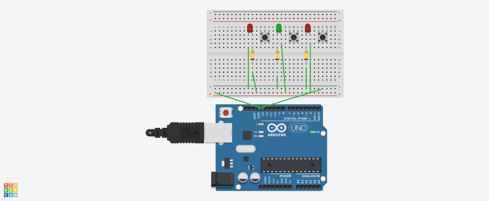

# 💡 Arduino LED Control with Buttons

This is a beginner-friendly Arduino project where three LEDs are controlled using three individual push buttons. Each button toggles one LED on or off.

## 🎯 Project Goal
Learn how to:
- Use push buttons as digital inputs
- Control LEDs using Arduino
- Read input states and control output pins

## 📦 Components Used
- 1x Arduino Uno
- 3x LEDs
- 3x 220Ω resistors (for the LEDs)
- 3x Push buttons
- 3x 10kΩ resistors (for pull-down on the buttons)
- Breadboard
- Jumper wires

## 🔌 Circuit Diagram
- Each LED to a digital pin through a 220Ω resistor.
- Each button between ground and a digital pin with a pull-down resistor (10kΩ) to ground.

## 📄 Arduino Code
The code is in the file `sketch_code.ino`.

Basic logic:
- Read each button state using `digitalRead()`
- Use `digitalWrite()` to turn each LED on or off based on button input

## 🚀 Upload Instructions
1. Open the `.ino` file in the Arduino IDE
2. Select the correct board and port
3. Upload the code to your Arduino
4. Press the buttons and watch the LEDs light up!

## 📸 Project Images

## 📽️ Explanatory video
https://github.com/user-attachments/assets/a644ec17-914e-4d46-aeb2-4594483567a6

---
## 👤 Author
> Designed by: [Abdulrahman Qutah]  
> Date: [30 June 2025]
